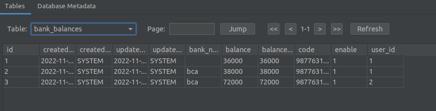
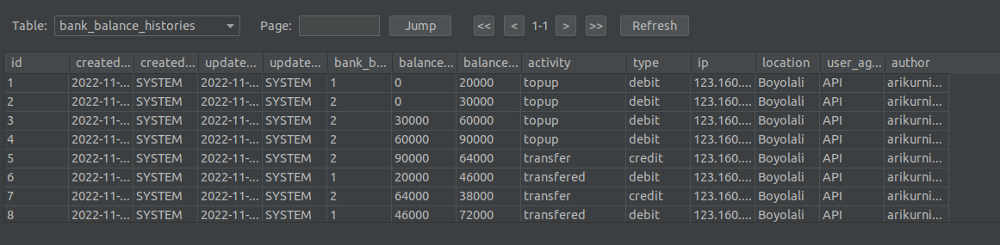
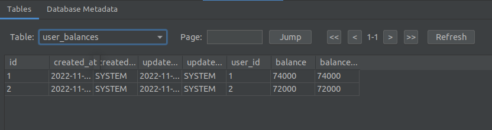
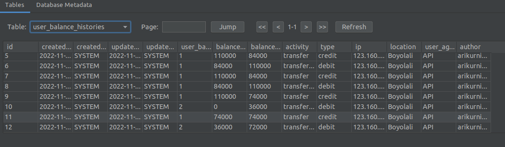
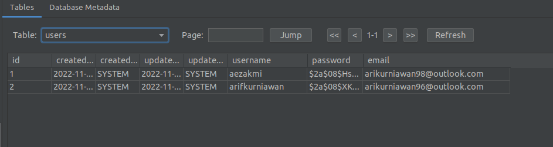

## USER TOPUP AND BALANCE

- Name : Arif Kurniawan
- Email : arifkurniawan98@outlook.com
- Postman : https://www.getpostman.com/collections/22b878561da1fa34a635

### How to Run in local
- clone this repo
- go mod tidy
- go run main.go

### Tech Stack
- Programming language : Golang
- API framework : Gin Gorm
- Database : Sqlite

### Question
- Because I don't fully understand the questions and I'm short on time, I'm assuming the bank balance is a virtual account linked to the user.
- So user can have more than one virtual account, and user balance will calculate from total amount in all virtual account

### Notes
- gorm is not supported enum for sqlite, so to handle this used constant when update to database
- token will generate when user is login, and token while be set to cookies
- to access menu in prefix users, user need login first
- before topup, user should create virtual account
- when user logout, token will be destroyed
- for topup or transfer, minimum amount is 10000
- if user have more than one virtual account, user can transfer to each other
- user also can transfer to another user

### Status In Program
#### activity (history)
- topup (when user doing topup to virtual account)
- transfer (when user doing transfer to another user)
- transfered (when user received transfer from another user)

#### type
- debit (when balance user added, example topup and received transfer)
- credit (when user balance deducted, example when doing transfer)

#### example table

